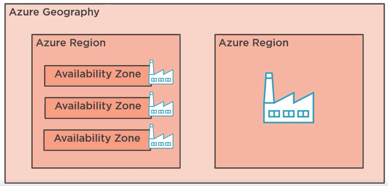

## Az-900 exam preparation

##### Quick Links
- [Product available by Region](https://azure.microsoft.com/en-us/global-infrastructure/services/?products=all)
- [Azure Geographies](https://azure.microsoft.com/en-us/global-infrastructure/geographies)
- [Price Calculator](https://azure.microsoft.com/en-us/pricing/calculator/)
- [Infrastructure Azure](https://infrastructuremap.microsoft.com/)
---
##### Overview of Cloud Computing

##### Examples

| Examples | Iaas   | Paas | Saas |
| ---   | --- | --- | --- |    
|  | Microsoft Azure | Azure logic Apps | Office 365 | 
|  | Amazon Web Service | Heroku | Google G Suite | 
| | Google Compute Engine | Amazon Elastic BeanStack | Salesforce | 
| By Microsoft |  |  |  | 
|  | Azure Compute | Azure logic apps | SharePoint |
|  | Azure Storage | Azure functions | One Drive |
|  |  | Azure web jobs | Microsoft teams |
|  |  | Azure automation | Power platform |

##### Common IaaS scenarios: 
 - test and development 
 - storage and backups
 - high performance computing 
 - big data analysis
##### Common PaaS scenarios: 
 - analytics or business intelligence 
 - development framework
##### Common SaaS scenarios: 
 - access to user friendly applications
 - mobilize your workforce easily

##### Deployment models
 - `Public Cloud` cloud service provided by a third party provider, hardware is shared among multiple clients
    - Azure, Aws
 - `Private Cloud` Hardware is only used by a single company, which often owns them.
 - `Hybrid Could` Combination of public and private cloud with automation and orchestration between them.
    - Azure stack
 - `Community Cloud` infrastructure is shared between several orgs from a specific community with common concerns(security, compliance, jurisdiction)
    - FedRAMP / DOD
    - Azure china and germany
---

##### Table of Content
- Azure Data Centers
- Regions & Availability zones
- Azure Resource Groups
- Azure Resource Manager
   - Azure Portal
   - Azure Powershell
   - Azure Cli
   - Rest Interface
- Resource Manager Templates
- Azure Advisor
---
##### Azure Data Centers
 - What is IT PAC?
   - Microsoft preassembled component.
   An ITPAC is a pre-manufactured, fully-assembled module that can be built with a focus on sustainable materials such as steel and aluminum and can house as little as 400 servers and as many as 2,000 servers, significantly increasing flexibility and scalability.
 - What are the Security standards maintained by Microsoft?
     - `ISO27001` - ISO/IEC 27001 is an international standard on how to manage information security.
     - `HIPAA` - The Health Insurance Portability and Accountability Act of 1996 (HIPAA or the Kennedy–Kassebaum Act) is a United States federal statute 
     - `FedRAMP` - The Federal Risk and Authorization Management Program is a United States federal government-wide program that provides a standardized approach to security assessment, authorization, and continuous monitoring for cloud products and services.
     - `SOC 1 & 2` - The SOC 1 and 2 reports help gain transparency of the specific controls implemented by a service organization, and the tests performed by the auditor. The success or failure of these controls has a direct or indirect impact on the reputation, financial statements and stability of the user organization.
---
##### Regions & Availability zones
      - Azure regions
      - Azure Geographies 
      - Availability Zones
      - Region Pairs

   - What are Azure Regions?
      User get to choose the real data center location or server location depending on requirements(Data transfer, physical location, availability, cost and features enabled on the region). By default its central USA.
      Use [Product available by Region](https://azure.microsoft.com/en-us/global-infrastructure/services/?products=all) link to understand more about features present in various location.
      Here is the list of regions from cli [Click here](../az900/AzureRegions.md)
      

   - What is Data residency and protection?
      To avoid regulations with certain geo location & data security policy violation.
   - Availability Zones & Region Pairs
      - Regions within a geography.
      - Data centers generally 300miles apart to avoid natural calamity impacts
      - Automatic replication and failover for some services
      - High Availability with service update and Outage recovery prioritization.  
   - Azure Geography
   
         Multiple available zones within same region and multiple regions within same geography is to create load balancing and handle large number of requests and fail overs. 
---
##### Azure Resource Groups
[Read more](https://docs.microsoft.com/en-us/azure/azure-resource-manager/management/manage-resource-groups-portal)

A resource group is a container that holds related resources for an Azure solution. The resource group can include all the resources for the solution, or only those resources that you want to manage as a group. You decide how you want to allocate resources to resource groups based on what makes the most sense for your organization. Generally, add resources that share the same lifecycle to the same resource group so you can easily deploy, update, and delete them as a group.

The resource group stores metadata about the resources. Therefore, when you specify a location for the resource group, you are specifying where that metadata is stored. For compliance reasons, you may need to ensure that your data is stored in a particular region.

Advantages of Azure Resource Group
 - Resources share the same life cycle.
 - Resources can only exist in one resource group
 - Resources can communicate across resource groups.
 - Containers for security boundaries.
 - Azure policies can be defined for all resource in a group
 - Can export infrastructure-as-code using Resource manager templates
 - Resources can remain in different regions 

Create Azure Group from CLI : [Azure Cli](../az900/AzureCliCommands.md)

###### Azure Resource manager :
[Read More](https://docs.microsoft.com/en-us/azure/azure-resource-manager/management/overview)
Azure Resource Manager is the deployment and management service for Azure. It provides a management layer that enables you to create, update, and delete resources in your Azure account. You use management features, like access control, locks, and tags, to secure and organize your resources after deployment.

4 ways of using Azure resource manager:
- Install and use [Azure Cli](https://docs.microsoft.com/en-us/cli/azure/install-azure-cli-windows?tabs=azure-cli)
- Azure Portal
- Azure Powershell
- Rest Interface

Advantages of using resource manager :
- manages your infrastructure through declarative template rather than scripts.
- Deploy, manage and monitor all the resources for your solution as a group, rather than handling these resources individually. 
- Redeploy your solution throughout the development lifecycle and have confidence your resources are deployed in a consistent state. 
- Defines dependencies between resources so they are deployed in the correct order
- Apply access control to all services because Azure role based access control is natively integrated into the management platform.
- Apply tags to resources t logically organize all the resources in your subscription. 
Clarify your organization billing by viewing costs for a group of resources share the same tag.

---
##### Links for services in detail
- Azure Functions: https://docs.microsoft.com/en-us/azure/azure-functions/
- Azure App Service: https://docs.microsoft.com/en-us/azure/app-service/
- Azure Kubernetes Service: https://docs.microsoft.com/en-us/azure/aks/
- Azure Cosmos DB: https://docs.microsoft.com/en-us/azure/cosmos-db/
- Azure Blob Storage: https://docs.microsoft.com/en-us/azure/storage/blobs/storage-blobs-introduction
- Azure Monitor: https://docs.microsoft.com/en-us/azure/azure-monitor/
- Azure Stream Analytics: https://docs.microsoft.com/en-us/azure/stream-analytics/
- Azure Logic Apps: https://docs.microsoft.com/en-us/azure/logic-apps/
- Azure Event Grid: https://docs.microsoft.com/en-us/azure/event-grid/
- Azure Service Bus: https://docs.microsoft.com/en-us/azure/service-bus/
- Azure API Management: https://docs.microsoft.com/en-us/azure/api-management/
- Azure DevOps: https://docs.microsoft.com/en-us/azure/devops/?view=azure-devops
- Azure Machine Learning: https://docs.microsoft.com/en-us/azure/machine-learning/
- Azure Cognitive Services: https://docs.microsoft.com/en-us/azure/cognitive-services/welcome
